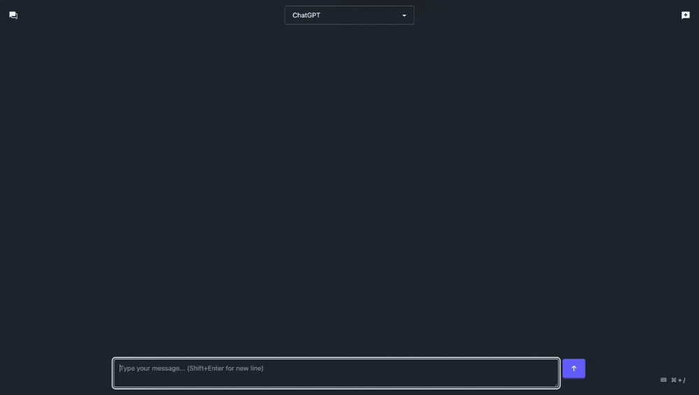

# Akson

Akson is an open-source platform for building and running AI assistants.
The system combines an API, web interface, and command-line tool to build and manage AI-driven agents.
The platform is modular and extensible, enabling customization and rapid iteration.



## Our Vision

Akson was born from a simple yet powerful idea: making AI assistants as easy to deploy as traditional web applications.
Just like how Apache web server made it simple to serve PHP applications, Akson enables you to drop a Python file into the assistants folder and instantly have a working AI assistant accessible through our web interface.

### Key Principles

- **Simplicity**: Akson is accessible to anyone who can use a text editor and write basic Python code.
Advanced features are available for those who need them.

- **Data Ownership**: Akson stores all conversations locally in JSON format, giving you control over your data and the ability to export or process it.

- **Self-Hosted**: Akson runs on your hardware without external dependencies.

- **Rapid Prototyping**: Akson lets you implement agent logic without frontend development or deployment infrastructure.

- **Minimal Dependencies**: The codebase has minimal external dependencies, making it easy to understand, fork, and customize.

## Features

- 🚀 **Rapid Development**: Create AI assistants with just a Python file
- 🔒 **Data Privacy**: All conversations stored locally in JSON format
- 🏠 **Self-Hosted**: Run everything on your own hardware
- 🛠️ **Extensible**: Easy to customize and extend
- 🌐 **Web Interface**: Modern React-based UI
- 📱 **CLI Support**: Command-line interface for automation
- 🔌 **API Access**: Integrate assistants into your applications

## What You Can Do

Once the services are running, you can:
- Interact with AI assistants through the web interface or CLI
- Use the API to integrate assistants into your applications
- Create and customize your own AI assistants

## Getting Started

### Prerequisites

Before you begin, ensure you have the following installed:
- [Docker Compose](https://docs.docker.com/compose/install/) (v2.0.0 or later)

### Installation

1. Clone the repository:
   ```bash
   git clone https://github.com/akson-ai/akson.git
   cd akson
   ```

2. Set up environment files:

   a. First, copy the docker-compose environment file:
   ```bash
   cp .env.example .env
   ```
   The default values are suitable for running the stack on localhost.
   If you plan to host Akson under a custom domain, you'll need to modify the environment variables accordingly.

   b. Then, copy the API environment file:
   ```bash
   cp api/.env.example api/.env
   ```
   You'll need to set up at least the `OPENAI_API_KEY` in this file.
   You can get a new API key from [OpenAI's platform](https://platform.openai.com/api-keys).

3. Start the services:
   ```bash
   docker compose up --build --watch
   ```

   The flags used in this command:
   - `--build`: Forces Docker to rebuild the images before starting the containers, ensuring you have the latest code changes
   - `--watch`: Enables watch mode, which automatically rebuilds and restarts containers when you make changes to the source code

4. Access the services:
   - Web Interface: [http://localhost:5173](http://localhost:5173)
   - API: [http://localhost:8000](http://localhost:8000)

5. (Optional) To run the CLI tool:
   ```bash
   docker compose run --build --rm cli
   ```

## Project Structure

```
akson/
├── api/                  # Backend API service
│   ├── assistants/       # Custom AI assistant implementations
│   ├── framework/        # Core framework components
│   └── chats/            # Chat storage
│
├── web/                  # Frontend web application
│   ├── src/              # React source code
│   └── public/           # Static assets
│
├── cli/                  # Command-line interface
│
└── compose.yaml          # Docker Compose configuration
```

## Components

### [api](./api)
The core backend service that powers Akson.
Built with Python and FastAPI, it provides a flexible foundation for creating and managing AI assistants.
One of its key features is the ability to add custom AI assistants, allowing you to tailor the platform to your specific needs.

**Technical Stack:**
- Python
- FastAPI for the API
- LiteLLM for the LLM integration

### [web](./web)
A modern React-based web interface for Akson that provides an intuitive user experience for interacting with Akson's features through your browser.

**Technical Stack:**
- JavaScript
- React for the frontend framework
- Vite for fast development and building
- DaisyUI for the UI components

### [cli](./cli)
A command-line interface tool that helps you manage and interact with your AI assistants directly from your terminal.
Perfect for automation and quick access to your assistants.

**Technical Stack:**
- Python
- Click for the CLI framework

## Core Concepts

### Assistant
An Assistant is a Python file in the [`api/assistants`](./api/assistants) folder.
Each assistant implements the `def run(chat: Chat) -> None` interface, which defines how the assistant processes and responds to messages.
You can write a custom assistant by implementing this interface, giving you control over the conversation flow and allowing you to send control messages to the frontend application.

### Agent
An Agent is a class that implements Assistant's `run` method.
It's the implementation of an assistant's behavior.
Agents live in the [`api/assistants`](./api/assistants) folder.
The Agent class provides an abstraction for creating assistants by specifying:
- Agent name
- Instructions
- Tools

### Chat
A Chat object is passed to the `run` method of assistants.
It represents the state of a conversation, which is persisted to disk, and provides methods for sending messages to the frontend application and managing the conversation flow.

## System Design

### Chat-Based System
Akson's architecture is built around chat-based interactions.
Each conversation is uniquely identified and maintains its own message history.
When a user initiates a conversation with an assistant, the backend API processes the request by invoking the assistant's `run` method with the corresponding Chat object.
The assistant then processes the input and adds its response to the conversation's message history.

### Development Setup
Both the backend (FastAPI) and frontend (React) applications are configured to run in development mode, enabling features like hot reloading for rapid development cycles.
This setup is optimized for development and prototyping, with production deployment considerations planned for future releases.

## Creating Your First Assistant

1. Write your AI assistant as a Python file and place it in the [`assistants`](./api/assistants) directory.
2. Interact with your assistants through the web interface or the command-line interface.

## Feedback & Suggestions

While the project is not accepting code contributions at this time, feedback and suggestions are welcome!
Here's how you can contribute:

- Open [GitHub issues](https://github.com/akson-ai/akson/issues) to report bugs or technical problems
- Join [GitHub discussions](https://github.com/akson-ai/akson/discussions) to:
  - Share ideas for potential use cases
  - Provide feedback on the current architecture and design
  - Discuss potential agent ideas
  - Engage with the community

## License

Akson is open-source software licensed under the MIT License.

---

Made with ❤️ by the Akson team